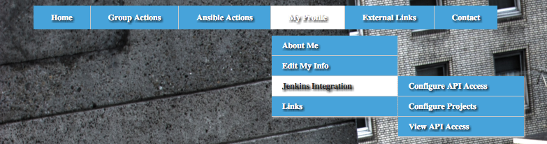
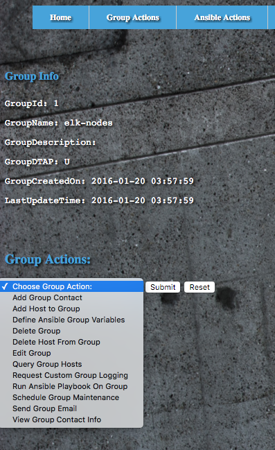
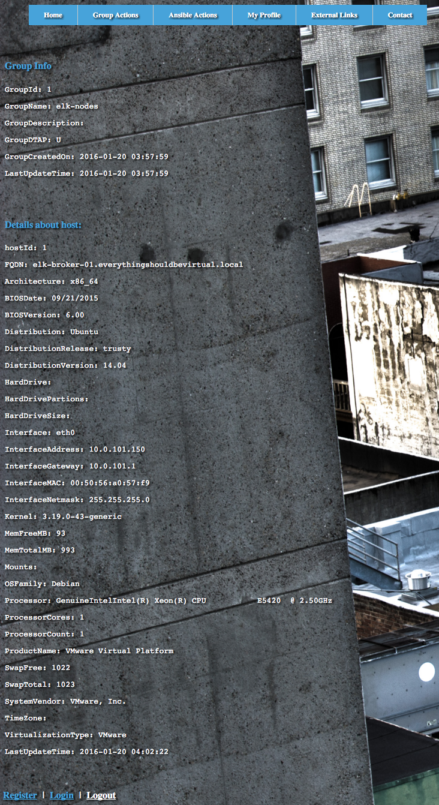

Information
===========

This is a project that I started about 6-7 months ago. I worked on it for a bit and put it down.
The intention of this was to turn into an Ansible Tower alternative with a ton of options. Allowing
for back-end components to be pluggable. Jenkins integration, ELKStack, PowerDNS, PHPipam, VMWare,
OpenStack and so much more. I initially built this around a simple SQLite DB but planned on porting
to MySQL. I wrote all of the PHP code for the pages and etc. So yeah...a lot of work needed there.

So I have decided to put this out here in hopes that maybe someone may have a need for something
like this and/or contribute to this and push it along as an open-source project. Then again
it may not be of any use but in any case. I am putting it out here. Feel free to contribute as you
see fit.

I had huge plans for this but honestly for one person it was a lot to take on and I have been  
sitting on this code for months and figured it was time to open this up to anyone and everyone  
and see what we can come up with.

Enjoy!

Usage
-----
###### Vagrant
You can spin this up in a Vagrant environment easily for testing and hacking.
````
vagrant up
````
Once deployed open your browser of choice and browse to http://127.0.0.1:8080

There is not a default login so you will need to click register at the bottom left  
of the page. Enter your details and then submit and login with the username/password  
you registered with. This registration is in no way sent anywhere. It is purely  
written to the DB and then a lookup is done to the DB for logins. (This obviously  
needs work).

There are many playbooks to utilize within the playbooks directory. You can generate  
host groups and inventory with details about hosts which are discovered via ansible  
facts. Those facts can be imported into the DB and then will show up in the WebUI.  
Once those fields are populated you can then import playbooks and etc. to run against  
a group of hosts or a single host. Lot's of options...Many are not complete.

Contributing
------------
Highly encouraged. Fork this project. Hack away at it. Submit a PR and let's keep  
this project going.

Screenshots
-----------






License
-------

Apache 2.0

Author Information
------------------

Larry Smith Jr.
- @mrlesmithjr
- http://everythingshouldbevirtual.com
- mrlesmithjr [at] gmail.com
