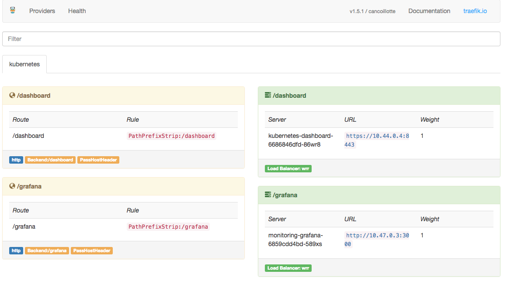
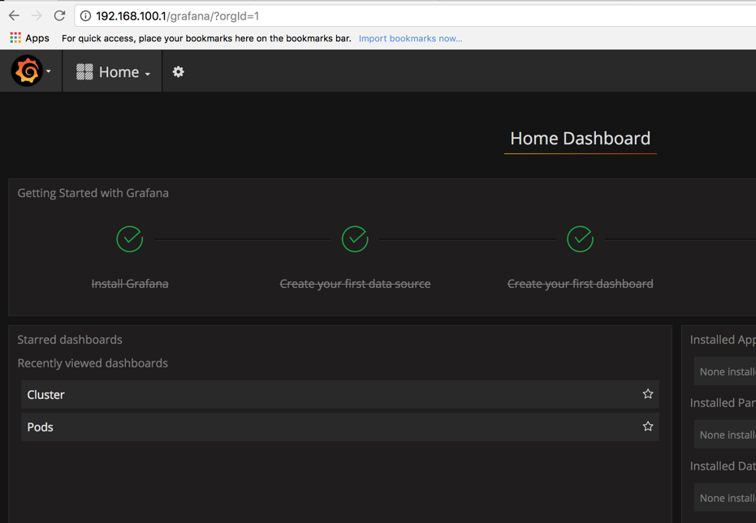

<!-- START doctoc generated TOC please keep comment here to allow auto update -->
<!-- DON'T EDIT THIS SECTION, INSTEAD RE-RUN doctoc TO UPDATE -->
**Table of Contents**  *generated with [DocToc](https://github.com/thlorenz/doctoc)*

- [ansible-rpi-k8s-cluster](#ansible-rpi-k8s-cluster)
  - [Background](#background)
    - [Why?](#why)
    - [How It Works](#how-it-works)
  - [Requirements](#requirements)
    - [Software](#software)
      - [Ansible](#ansible)
      - [Kubernetes CLI Tools](#kubernetes-cli-tools)
    - [Hardware](#hardware)
    - [OS](#os)
      - [Downloading OS](#downloading-os)
      - [Installing OS](#installing-os)
        - [First SD Card](#first-sd-card)
          - [Install OS Image](#install-os-image)
        - [Remaining SD cards](#remaining-sd-cards)
  - [Deploying](#deploying)
    - [Ansible Variables](#ansible-variables)
    - [DHCP For Cluster](#dhcp-for-cluster)
      - [inventory/group_vars/all/all.yml](#inventorygroup_varsallallyml)
      - [inventory/hosts.inv](#inventoryhostsinv)
    - [Ansible Playbook](#ansible-playbook)
      - [Gotchas](#gotchas)
        - [sshpass error](#sshpass-error)
        - [SSH Key Missing](#ssh-key-missing)
        - [Fixing Broken GlusterFS Repo](#fixing-broken-glusterfs-repo)
    - [Managing WI-FI On First Node](#managing-wi-fi-on-first-node)
  - [Routing](#routing)
    - [Adding Static Route On macOS](#adding-static-route-on-macos)
    - [Deleting Static Route on macOS](#deleting-static-route-on-macos)
  - [Load Balancing And Exposing Services](#load-balancing-and-exposing-services)
    - [Deploying Traefik](#deploying-traefik)
    - [Accessing Traefik WebUI](#accessing-traefik-webui)
    - [Load Balanced NGINX Demo Deployment](#load-balanced-nginx-demo-deployment)
  - [Kubernetes Dashboard](#kubernetes-dashboard)
    - [kubectl proxy](#kubectl-proxy)
    - [SSH Tunnel](#ssh-tunnel)
    - [Admin Privileges](#admin-privileges)
  - [Cluster DNS and Service Discovery](#cluster-dns-and-service-discovery)
    - [CoreDNS](#coredns)
      - [Update Existing Cluster Using `kubectl`](#update-existing-cluster-using-kubectl)
      - [Update Existing Cluster Using `kubeadm`](#update-existing-cluster-using-kubeadm)
      - [Verifying CoreDNS](#verifying-coredns)
  - [Helm](#helm)
  - [Persistent Storage](#persistent-storage)
    - [GlusterFS](#glusterfs)
    - [Deploying GlusterFS In Kubernetes](#deploying-glusterfs-in-kubernetes)
    - [Using GlusterFS In Kubernetes Pod](#using-glusterfs-in-kubernetes-pod)
  - [Monitoring](#monitoring)
    - [Heapster](#heapster)
    - [InfluxDB/Grafana](#influxdbgrafana)
  - [Resetting The Kubernetes Cluster](#resetting-the-kubernetes-cluster)
  - [License](#license)
  - [Author Information](#author-information)

<!-- END doctoc generated TOC please keep comment here to allow auto update -->

# ansible-rpi-k8s-cluster

This repo will be used for deploying a Kubernetes cluster on Raspberry Pi using
Ansible.

## Background

### Why?

I have been looking at putting together a Kubernetes cluster using Raspberry
Pi's for a while now. And I finally pulled all of it together and started pulling
together numerous `Ansible` roles which I had already developed over time. I
wanted this whole project to be provisioned with `Ansible` so I had a repeatable
process to build everything out. As well as a way to share with others. I am
still putting all of the pieces together so this will no doubt be a continual
updated repo for some time.

### How It Works

The following will outline the design of how this current iteration works.
Basically we have a 5 (or more) node Raspberry Pi cluster. With the first node
connecting to wireless to act as our gateway into the cluster. The first node is
by far the most critical. We use the first nodes wireless connection to also do
all of our provisioning of our cluster. We execute `Ansible` against all of the
remaining nodes by using the first node as a bastion host via it's wireless IP.
Once you obtain the IP of the first node's wireless connection you need to
update `jumphost_ip:` in [inventory/group_vars/all/all.yml](inventory/group_vars/all/all.yml)
as well as change the `ansible_host` for `rpi-k8s-1 ansible_host=172.16.24.186`
in [inventory/hosts.inv](inventory/hosts.inv). If you would like to change the
subnet which the cluster will use, change `dhcp_scope_subnet:` in [inventory/group_vars/all/all.yml](inventory/group_vars/all/all.yml)
to your desired subnet as well as the `ansible_host` addresses for the following
nodes in [inventory/hosts.inv](inventory/hosts.inv):

```bash
[rpi_k8s_slaves]
rpi-k8s-2 ansible_host=192.168.100.128
rpi-k8s-3 ansible_host=192.168.100.129
rpi-k8s-4 ansible_host=192.168.100.130
rpi-k8s-5 ansible_host=192.168.100.131
```

> NOTE: We may change to an automated inventory being generated if it makes things
> a little more easy.

The first node provides the following services for our cluster:

-   DHCP for all of the other nodes (only listening on `eth0`)
-   Gateway services for other nodes to connect to the internet and such.
    -   An IPTABLES Masquerade rule NATs traffic from `eth0` through `wlan0`
-   [Apt-Cacher NG](https://www.unix-ag.uni-kl.de/~bloch/acng/) - A package caching proxy to speed up package downloads/installs.

> NOTE: You can also define a static route on your LAN network firewall (if supported)
> for the subnet (`192.168.100.0/24` in my case) to the wireless IP address that
> your first node obtains. Or you may add a [static route](#routing) on your Ansible
> control machine. This will allow you to communicate with all of the
> cluster nodes once they get an IP via DHCP from the first node.

For Kubernetes networking we are using [Weave Net](https://www.weave.works/docs/net/latest/kubernetes/kube-addon/).

## Requirements

### Software

The following is a list of the required packages to be installed on your `Ansible`
control machine (the machine you will be executing Ansible from).

#### Ansible

You can install `Ansible` in many different ways so head over to the official
`Ansible` [intro installation](http://docs.ansible.com/ansible/latest/intro_installation.html).

#### Kubernetes CLI Tools

You will also need to install the `kubectl` package. As with `Ansible`
there are many different ways to install `kubectl` so head over to the official
`Kubernetes` [Install and Set Up kubectl](https://kubernetes.io/docs/tasks/tools/install-kubectl/).

> NOTE: The Ansible playbook [playbooks/deployments.yml](playbooks/deployments.yml)
> fetches the `admin.conf` from the K8s master and copies this to your local
> $HOME/.kube/config. This allows us to run `kubectl` commands remotely to the
> cluster. There is a catch here though. The certificate is signed with the
> internal IP address of the K8s master. So in order for this to work correctly
> you will need to setup a static route on your firewall (if supported) to the
> subnet `192.168.100.0/24`(in our case) via the wireless IP on your first
> node (also the K8s master). Or you may add a [static route](#routing) on your Ansible
> control machine.

### Hardware

The following list is the hardware which I am using currently while developing
this.

-   5 x [Raspberry Pi 3](http://amzn.to/2EbDKfq)
-   2 x [6pack - Cat 6 - Flat Ethernet Cables](http://amzn.to/2nKvywD)
-   1 x [Anker PowerPort 6 - 60W 6-Port Charging Hub](http://amzn.to/2ERkV2q)
-   5 x [Samsung 32GB 95MB/s MicroSD Evo Memory Card](http://amzn.to/2skSlno)
-   1 x [GeauxRobot Raspberry Pi 3 5-Layer Dog Bone Stack Case](http://amzn.to/2Edbqcw)
-   1 x 8-Port Ethernet Switch

### OS

Currently I am using [Raspbian Lite](http://raspbian.org/) for the OS. I did
not orginally go with Hyperiot intentionally but may give it a go at some point.

#### Downloading OS

Head over [here](https://www.raspberrypi.org/downloads/raspbian/) and download
the `RASPBIAN STRETCH LITE` image.

#### Installing OS

I am using a Mac so my process will based on that so you may need to adjust
based on your OS.

After you have finished [downloading](#downloading-os) the OS you will want to
extract the zip file `2017-11-29-raspbian-stretch-lite.zip` in my case. After
extrating the file you are ready to load the OS onto each and every SD card. In
my case I am paying special attention to the first one. The first one we will be
adding the `wpa_supplicant.conf` file which will connect us to wireless. We will
use wireless as our gateway into the cluster. We want to keep this as isolated
as possible.

##### First SD Card

With our zip file extracted we are now ready to load the image onto our SD card.
Remember what I mentioned above, the first one is the one which we will use to
connect to wireless.

###### Install OS Image

> NOTE: Remember I am using a Mac so YMMV! You may also want to look into
> [Etcher](https://etcher.io/) or [PiBakery](http://www.pibakery.org/) for a
> GUI based approach.

Open up your terminal and execute the following to determine the device name of
the SD card:

```bash
diskutil list
...
/dev/disk0 (internal, physical):
   #:                       TYPE NAME                    SIZE       IDENTIFIER
   0:      GUID_partition_scheme                        *500.3 GB   disk0
   1:                        EFI EFI                     209.7 MB   disk0s1
   2:          Apple_CoreStorage macOS                   499.4 GB   disk0s2
   3:                 Apple_Boot Recovery HD             650.0 MB   disk0s3

/dev/disk1 (internal, virtual):
   #:                       TYPE NAME                    SIZE       IDENTIFIER
   0:                  Apple_HFS macOS                  +499.0 GB   disk1
                                 Logical Volume on disk0s2
                                 7260501D-EA09-4048-91FA-3A911D627C9B
                                 Unencrypted

/dev/disk2 (external, physical):
   #:                       TYPE NAME                    SIZE       IDENTIFIER
   0:     FDisk_partition_scheme                        *32.0 GB     disk2
   1:                 DOS_FAT_16 NEW VOLUME              32.0 GB     disk2s1
```

From the above in my case I will be using `/dev/disk2` which is my SD card.

Now we need to unmount the disk so we can write to it:

```bash
diskutil unmountdisk /dev/disk2
```

Now that our SD card is unmounted we are ready to write the OS image to it. And
we do that by running the following in our terminal:

```bash
sudo dd bs=1m if=/Users/larry/Downloads/2017-11-29-raspbian-stretch-lite.img of=/dev/disk2 conv=sync
```

After that completes we now need to remount the SD card so that we can write
some files to it.

```bash
diskutil mountdisk /dev/disk2
```

First we need to create a blank file `ssh` onto the SD card to enable SSH when
the Pi boots up.

```bash
touch /Volumes/boot/ssh
```

Next we need to create the `wpa_supplicant.conf` file which will contain the
configuration to connect to wireless. The contents of this file are listed below:

```bash
vi /Volumes/boot/wpa_supplicant.conf
```

`wpa_supplicant.conf`:

```bash
country=US
ctrl_interface=DIR=/var/run/wpa_supplicant GROUP=netdev
update_config=1

network={
    ssid="your_real_wifi_ssid"
    scan_ssid=1
    psk="your_real_password"
    key_mgmt=WPA-PSK
}
```

Now that you have finished creating these files you can then unmount the SD card:

```bash
diskutil unmountdisk /dev/disk2
```

Now set this first one aside or place it into your Raspberry Pi that you want to
be the first node.

##### Remaining SD cards

For the remaining SD cards you will follow the same process as in [First SD Card](#first-sd-card)
except you will not create the `wpa_supplicant.conf` file on these. Unless you
want to use wireless for all of your Pi's. If that is the case then that will be
out of scope for this project (for now!).

## Deploying

### Ansible Variables

Most variables that need to be adjusted based on deployment can be found in
[inventory/group_vars/all/all.yml](inventory/group_vars/all/all.yml). Make sure
to update `jumphost_ip` to the IP address that your first node obtained via DHCP
and `rpi_nodes` to define the number of cluster nodes. If you do not define the
`rpi_nodes` correctly and you fire up all of your cluster nodes. After the first
node is provisioned for DHCP we wait for the number of DHCP leases to equal the
number of cluster nodes (minus the first node). So if this is incorrect,
provisioning will fail. So keep that in mind.

### DHCP For Cluster

> NOTE: We are using our cluster as cattle and not pets here folks. If you want
> to hand hold your cluster nodes then you will need to go to further extents
> beyond what this project is about. The only pet we have here is our first cluster
> node. This is because we need to know which one we need to connect to wireless,
> and which one routes, provides DHCP, and etc.

By default we are using `DNSMasq` now to provide DHCP for the cluster nodes.
**(Note: The first cluster node does not get it's address via DHCP, it is statically assigned)**
Being that we are using DHCP for the cluster nodes we need to first make sure
that we account for the number of cluster nodes we are using. With this being
said, we need to adjust a few variables and the inventory to account for this.
The assumption within this project is that we are using 5 cluster nodes which is
how DHCP is configured to accomodate such.

The important things to ensure that are configured correctly are listed below:

#### [inventory/group_vars/all/all.yml](inventory/group_vars/all/all.yml)

You should change the `dhcp_scope_subnet: 192.168.100`, `dhcp_scope_start_range: "{{ dhcp_scope_subnet }}.128"`, `dhcp_scope_end_range: "{{ dhcp_scope_subnet }}.131"`, and `rpi_nodes`
variables to meet your requirements. Please review [ansible-variables](#ansible-variables)
for further explanation on the importance of `rpi_nodes`.

```yaml
# Defines DHCP scope end address
dhcp_scope_end_range: "{{ dhcp_scope_subnet }}.131"

# Defines DHCP scope start address
dhcp_scope_start_range: "{{ dhcp_scope_subnet }}.128"

# Defines dhcp scope subnet for isolated network
dhcp_scope_subnet: 192.168.100

# Defines the number of nodes in cluster
# Extremely important to define correctly, otherwise provisioning will fail.
rpi_nodes: 5
```

Based on the above we can ensure that we are only handing out `4` IP addresses
to the cluster nodes because the first node again is statically assigned. This
will account for our `5` node cluster. So if you have a different number of cluster
nodes then you will need to adjust the start and end ranges. Why is this important?
Because we can then ensure that we can define our inventory appropriately. And
because we are treating all but our first node as cattle, we do not care which
one in the stack is which, just as long as we can assign addresses to them and we
can provision them.

#### [inventory/hosts.inv](inventory/hosts.inv)

Now, based on the details from above we need to ensure that our inventory is
properly configured. So make sure that your inventory matches the DHCP range
you defined and the nodes for the group `rpi_k8s_slaves` is accurate. Remembering
that we are treating our slaves as cattle.

```bash
[rpi_k8s_slaves]
rpi-k8s-2 ansible_host=192.168.100.128
rpi-k8s-3 ansible_host=192.168.100.129
rpi-k8s-4 ansible_host=192.168.100.130
rpi-k8s-5 ansible_host=192.168.100.131
```

### Ansible Playbook

To provision the full stack you can run the following:

```bash
ansible-playbook -i inventory playbooks/deploy.yml
```

#### Gotchas

If you happen to get the following error when attempting to deploy:

##### sshpass error

```bash
TASK [Gathering Facts] ***********************************************************************************************************************************************************
Sunday 11 February 2018  04:56:29 +0000 (0:00:00.029)       0:00:00.127 *******
fatal: [rpi-k8s-1]: FAILED! => {"msg": "to use the 'ssh' connection type with passwords, you must install the sshpass program"}
	to retry, use: --limit @/home/vagrant/ansible-rpi-k8s-cluster/playbooks/deploy.retry
```

Head over to [here](https://everythingshouldbevirtual.com/automation/ansible-2-3-1-sshpass-error/) to resolve that issue.

##### SSH Key Missing

If you happen to get the following error when attempting to deploy:

```bash
TASK [Adding Local User SSH Key] *************************************************************************************************************************************************
Sunday 11 February 2018  04:58:28 +0000 (0:00:00.022)       0:00:34.350 *******
 [WARNING]: Unable to find '/home/vagrant/.ssh/id_rsa.pub' in expected paths.

fatal: [rpi-k8s-1]: FAILED! => {"msg": "An unhandled exception occurred while running the lookup plugin 'file'. Error was a <class 'ansible.errors.AnsibleError'>, original message: could not locate file in lookup: /home/vagrant/.ssh/id_rsa.pub"}
	to retry, use: --limit @/home/vagrant/ansible-rpi-k8s-cluster/playbooks/deploy.retry
```

You will need to generate an SSH key for your local user that you are running
Ansible as:

```raw
ssh-keygen
...
Generating public/private rsa key pair.
Enter file in which to save the key (/home/vagrant/.ssh/id_rsa):
Enter passphrase (empty for no passphrase):
Enter same passphrase again:
Your identification has been saved in /home/vagrant/.ssh/id_rsa.
Your public key has been saved in /home/vagrant/.ssh/id_rsa.pub.
The key fingerprint is:
SHA256:pX5si9jHbpe2Ubss4eLjGlMs7J3iC7PHOwkiDCkPE74 vagrant@node0
The key's randomart image is:
+---[RSA 2048]----+
|                 |
|.                |
|.o        .      |
|*.     . +       |
|.*.     S o   .  |
| E+ . .o = ... . |
|   . .oo*o*..o.  |
|       B=B*.*o . |
|      o.B@==.oo  |
+----[SHA256]-----+
```

##### Fixing Broken GlusterFS Repo
If you experience the following [issue](https://github.com/mrlesmithjr/ansible-rpi-k8s-cluster/issues/7) you can
run the playbook [fix_glusterfs_repo.yml](playbooks/fix_glusterfs_repo.yml) which
will remove the broken `3.10` repo. Once that is done you should be good to go
and be able to run [deploy.yml](playbooks/deploy.yml) once again.

### Managing WI-FI On First Node

To manage the WI-FI connection on your first node. You can create a `wifi.yml`
file in `inventory/group_vars/all` with the following defined variables:

> NOTE: `wifi.yml` is added to the `.gitignore` to ensure that the file is excluded
> from Git. Use your best judgment here. It is probably a better idea to encrypt
> this file with `ansible-vault`. The task(s) to manage WI-FI are in [playbooks/bootstrap.yml](playbooks/bootstrap.yml) and will only trigger if the
> variables defined below exist.

```yaml
k8s_wifi_country: US
k8s_wifi_password: mysecretwifipassword
k8s_wifi_ssid: mywifissid
```

> CAUTION: If your WI-FI IP address changes, `Ansible` will fail as it will no
> longer be able to connect to the original IP address. Keep this in mind.

If you would like to simply manange the WI-FI connection you may run the following:

```bash
ansible-playbook -i inventory playbooks/bootstrap.yml --tags rpi-manage-wifi
```

## Routing

In order to use `kubectl` from your Ansible control machine, you need to ensure
that you have a static route either on your LAN firewall or your local routing
table on your Ansible control machine.

### Adding Static Route On macOS

In order to add a static route on you will need to do the following:

> NOTE: Replace `172.16.24.186` with the IP of that your first node obtained via
> DHCP. Also update `192.168.100.0/24` with the subnet that you changed the
> variable `dhcp_scope_subnet` in `inventory/group_vars/all/all.yml` to if you
> changed it.

```bash
sudo route -n add 192.168.100.0/24 172.16.24.186
...
Password:
add net 192.168.100.0: gateway 172.16.24.186
```

You can verify that the static route is definitely configured by executing the
following:

```bash
netstat -nr | grep 192.168.100
...
192.168.100        172.16.24.186      UGSc            0        0     en0
```

### Deleting Static Route on macOS

If you decide to delete the static route you can do so by executing the following:

```bash
sudo route -n delete 192.168.100.0/24 172.16.24.186
...
Password:
delete net 192.168.100.0: gateway 172.16.24.186
```

## Load Balancing And Exposing Services

We have included [Traefik](traefik.io) as an available load balancer which can
be deployed to expose cluster services.

### Deploying Traefik

You can deploy `Traefik` by running the following:

```bash
kubectl apply -f deployments/traefik.yaml
```

### Accessing Traefik WebUI

You can access the Traefik WebUI by heading over to <http://wirelessIP:8080/dashboard/#/>
(replace `wirelessIP` with your actual IP of the wireless address on the first node).



### Load Balanced NGINX Demo Deployment

We have an example NGINX deployment [deployments/nginx_deployment.yaml](deployments/nginx_deployment.yaml)
that you can easily spin up for learning and testing. This deployment creates
the `demo` Namespace, `nginx-demo` Deployment with `2` replicas using the `nginx`
image, `nginx-demo` Service, `nginx-demo` Ingress, and attaches itself to the `Traefik`
load balancer with the path `/demo` but strips the path prefix so that the default
NGINX container(s) will return the default page as `/` rather than `/demo` because
that would fail. You can then connect to the default web page by connecting to
<http://wirelessIP/demo>.

To spin up this demo simply execute the following:

```bash
kubectl apply -f deployments/nginx_deployment.yaml
```

To validate all is good:

```bash
kubectl get all --namespace demo
...
NAME                DESIRED   CURRENT   UP-TO-DATE   AVAILABLE   AGE
deploy/nginx-demo   2         2         2            2           11m

NAME                       DESIRED   CURRENT   READY     AGE
rs/nginx-demo-76c897787b   2         2         2         11m

NAME                DESIRED   CURRENT   UP-TO-DATE   AVAILABLE   AGE
deploy/nginx-demo   2         2         2            2           11m

NAME                       DESIRED   CURRENT   READY     AGE
rs/nginx-demo-76c897787b   2         2         2         11m

NAME                             READY     STATUS    RESTARTS   AGE
po/nginx-demo-76c897787b-gzwgl   1/1       Running   0          11m
po/nginx-demo-76c897787b-pzfrl   1/1       Running   0          11m

NAME             TYPE        CLUSTER-IP      EXTERNAL-IP   PORT(S)   AGE
svc/nginx-demo   ClusterIP   10.102.204.13   <none>        80/TCP    11m
```

To tear down this demo simply execute the following:

```bash
kubectl delete -f deployments/nginx_deployment.yaml
```

## Kubernetes Dashboard

We have included the Kubernetes dashboard as part of the provisioning. By
default the dashboard is only available from within the cluster. So in order to
connect to it you have a few options.

### kubectl proxy

If you have installed `kubectl` on your local machine then you can simply drop
to your terminal and type the following:

```bash
kubectl proxy
...
Starting to serve on 127.0.0.1:8001
```

Now you can open your browser of choice and head [here](http://127.0.0.1:8001/ui)

### SSH Tunnel

> NOTE: This method will also only work if you have a static route into the cluster
> subnet `192.168.100.0/24`.

You can also use an SSH tunnel to your Kubernetes master node (any cluster node
will work, but because the assumption is that the first node will be the only one
accessible over WI-FI). First you need to find the `kubernetes-dashboard`
ClusterIP, and you can do that by executing the following:

```bash
kubectl get svc --namespace kube-system kubernetes-dashboard
...
NAME                   TYPE        CLUSTER-IP      EXTERNAL-IP   PORT(S)   AGE
kubernetes-dashboard   ClusterIP   10.106.41.154   <none>        443/TCP   2d
```

And from the above you will see that the ClusterIP is `10.106.41.154`. Now you
can create the SSH tunnel as below:

```bash
ssh -L 8001:10.106.41.154:443 pi@172.16.24.186
```

Now you can open your browser of choice and head [here](https://127.0.0.1:8001/ui)

### Admin Privileges

If you would like to allow admin privileges without requiring either a kubeconfig
or token then you can apply the following `ClusterRoleBinding`:

> NOTE: You can find more details on this [here](https://github.com/kubernetes/dashboard/wiki/Access-control#admin-privileges).

```bash
kubectl apply -f deployments/dashboard-admin.yaml
```

And now when you connect to the dashboard you can click skip and have full admin
access. This is **obviously** not good practice, so you should delete this
`ClusterRoleBinding` when you are done:

```bash
kubectl delete -f deployments/dashboard-admin.yaml
```

## Cluster DNS and Service Discovery

### [CoreDNS](https://coredns.io)

You may wish to update the default `DNS` service to use `CoreDNS` to learn and/or
whatever you want. The good news is that `CoreDNS` will eventually be the default
`DNS` replacing `kube-dns`. So may as well start testing now!

#### Update Existing Cluster Using `kubectl`

> NOTE: CoreDNS can run in place of the standard Kube-DNS in Kubernetes. Using
> the kubernetes plugin, CoreDNS will read zone data from a Kubernetes cluster.

If you would like to replace the default `DNS` service installed during
provisioning with `CoreDNS`, you can easily do so by doing the following:

```bash
cd deployments
./deploy-coredns.sh | kubectl apply -f -
kubectl delete --namespace=kube-system deployment kube-dns
```

#### Update Existing Cluster Using `kubeadm`

The following can be used if you would rather use `kubeadm` to update your
cluster to use `CoreDNS` rather than using the `kubectl` method above. First you
should check to make sure that this method is possible within your cluster.

```raw
kubeadm upgrade plan  --feature-gates CoreDNS=true
...
[preflight] Running pre-flight checks.
[upgrade] Making sure the cluster is healthy:
[upgrade/config] Making sure the configuration is correct:
[upgrade/config] Reading configuration from the cluster...
[upgrade/config] FYI: You can look at this config file with 'kubectl -n kube-system get cm kubeadm-config -oyaml'
[upgrade] Fetching available versions to upgrade to
[upgrade/versions] Cluster version: v1.9.3
[upgrade/versions] kubeadm version: v1.9.2
[upgrade/versions] Latest stable version: v1.9.3
[upgrade/versions] Latest version in the v1.9 series: v1.9.3

Awesome, you're up-to-date! Enjoy!
```

#### Verifying CoreDNS

Checking `pod` status:

```bash
kubectl get pods --namespace kube-system -o wide
...
NAME                                          READY     STATUS    RESTARTS   AGE       IP                NODE
coredns-7f969bcf8c-458jv                      1/1       Running   0          22m       10.34.0.3         rpi-k8s-4
coredns-7f969bcf8c-nfpf7                      1/1       Running   0          22m       10.40.0.3         rpi-k8s-5
etcd-rpi-k8s-1                                1/1       Running   0          4d        192.168.100.1     rpi-k8s-1
heapster-8556df7b6b-cplz6                     1/1       Running   0          4d        10.34.0.0         rpi-k8s-4
kube-apiserver-rpi-k8s-1                      1/1       Running   2          4d        192.168.100.1     rpi-k8s-1
kube-controller-manager-rpi-k8s-1             1/1       Running   2          4d        192.168.100.1     rpi-k8s-1
kube-proxy-644h6                              1/1       Running   0          4d        192.168.100.130   rpi-k8s-4
kube-proxy-8dfbr                              1/1       Running   0          4d        192.168.100.1     rpi-k8s-1
kube-proxy-fcpqp                              1/1       Running   0          4d        192.168.100.131   rpi-k8s-5
kube-proxy-kh4jq                              1/1       Running   0          4d        192.168.100.128   rpi-k8s-2
kube-proxy-tjckk                              1/1       Running   0          4d        192.168.100.129   rpi-k8s-3
kube-scheduler-rpi-k8s-1                      1/1       Running   2          4d        192.168.100.1     rpi-k8s-1
kubernetes-dashboard-6686846dfd-z62q4         1/1       Running   0          4d        10.40.0.0         rpi-k8s-5
monitoring-grafana-6859cdd4bd-7bk5c           1/1       Running   0          4d        10.45.0.0         rpi-k8s-3
monitoring-influxdb-59cb7cb77b-rpmth          1/1       Running   0          4d        10.46.0.0         rpi-k8s-2
tiller-deploy-6499c74d46-hjgcr                1/1       Running   0          2d        10.40.0.1         rpi-k8s-5
traefik-ingress-controller-6ffd67bfcf-wb5m2   1/1       Running   0          2d        192.168.100.1     rpi-k8s-1
weave-net-7xfql                               2/2       Running   12         4d        192.168.100.1     rpi-k8s-1
weave-net-kxw2h                               2/2       Running   2          4d        192.168.100.129   rpi-k8s-3
weave-net-rxsfg                               2/2       Running   2          4d        192.168.100.128   rpi-k8s-2
weave-net-rzwd2                               2/2       Running   2          4d        192.168.100.131   rpi-k8s-5
weave-net-wnk26                               2/2       Running   2          4d        192.168.100.130   rpi-k8s-4
```

Checking `deployment` status:

```bash
kubectl get deployment --namespace kube-system
...
NAME                         DESIRED   CURRENT   UP-TO-DATE   AVAILABLE   AGE
coredns                      2         2         2            2           28m
heapster                     1         1         1            1           4d
kubernetes-dashboard         1         1         1            1           4d
monitoring-grafana           1         1         1            1           4d
monitoring-influxdb          1         1         1            1           4d
tiller-deploy                1         1         1            1           2d
traefik-ingress-controller   1         1         1            1           2d
```

Checking `dig` results:

First you need to find the `CLUSTER-IP`:

```bash
kubectl get service --namespace kube-system kube-dns
...
NAME       TYPE        CLUSTER-IP   EXTERNAL-IP   PORT(S)         AGE
kube-dns   ClusterIP   10.96.0.10   <none>        53/UDP,53/TCP   50m
```

Now you can use `dig`:

```raw
dig @10.96.0.10 default.svc.cluster.local +noall +answer
...
; <<>> DiG 9.10.3-P4-Raspbian <<>> @10.96.0.10 default.svc.cluster.local +noall +answer
; (1 server found)
;; global options: +cmd
default.svc.cluster.local. 5	IN	A	10.45.0.2
default.svc.cluster.local. 5	IN	A	10.96.0.1
default.svc.cluster.local. 5	IN	A	10.34.0.2
default.svc.cluster.local. 5	IN	A	10.109.20.92
```

## Helm

We have also enabled [Helm](https://github.com/kubernetes/helm) as part of the
provisioning of the cluster. However, because we are using Raspberry Pi's and Arm
architecture we need to make some adjustments post deployment.

```bash
kubectl create serviceaccount --namespace kube-system tiller
kubectl create clusterrolebinding tiller-cluster-rule --clusterrole=cluster-admin --serviceaccount=kube-system:tiller
kubectl patch deploy --namespace kube-system tiller-deploy -p '{"spec":{"template":{"spec":{"serviceAccount":"tiller"}}}}'
kubectl set image deploy/tiller-deploy tiller=luxas/tiller:v2.6.1 --namespace kube-system
```

## Persistent Storage

### GlusterFS

We have included [GlusterFS](https://www.gluster.org/) as backend for persistent
storage to be used by containers. We are not using [Heketi](https://github.com/heketi/heketi)
at this time. So all managment of `GlusterFS` is done via `Ansible`. Check out
the `group_vars` in [inventory/group_vars/rpi_k8s/glusterfs.yml](inventory/group_vars/rpi_k8s/glusterfs.yml)
to define the backend bricks and client mounts.

GlusterFS can also be defined to be available in specific namespaces by defining
the following in [inventory/group_vars/all/all.yml](inventory/group_vars/all/all.yml):

```yaml
k8s_glusterfs_namespaces:
  - default
  - kube-system
```

By defining GlusterFS into specific namespaces allows persistent storage to be
available for consumption within those namespaces.

### Deploying GlusterFS In Kubernetes

You must first deploy the Kubernetes `Endpoints` and `Service` defined in
[deployments/glusterfs.yaml](deployments/glusterfs.yaml). This file is dynamically
generated during provisioning if `glusterfs_volume_force_create: true`.

```bash
kubectl apply -f deployments/glusterfs.yaml
```

### Using GlusterFS In Kubernetes Pod

In order to use `GlusterFS` for persistent storage you must define your pod(s) to
do so. Below is an example of a pod definition:

```yaml
---
apiVersion: v1
kind: Pod
metadata:
  name: glusterfs
spec:
  containers:
    - name: glusterfs
      image: armhfbuild/nginx
      volumeMounts:
        - mountPath: /mnt/glusterfs
          name: glusterfsvol
  volumes:
  - name: glusterfsvol
    glusterfs:
      endpoints: glusterfs-cluster
      path: volume-1
      readOnly: false
```

## Monitoring

We have included a few deployments to get some monitoring of your environment
going as well. These include [Heapster](https://github.com/kubernetes/heapster),
[InfluxDB](https://www.influxdata.com/time-series-platform/influxdb/), and
[Grafana](https://grafana.com/).

### Heapster

In order to get cluster metrics into InfluxDB and Grafana we must first deploy
Heapster. Heapster enables container monitoring and performance analysis for
Kubernetes.
To deploy Heapster simply run the following:

```bash
kubectl apply -f deployments/heapster.yaml
...
clusterrolebinding "heapster" created
serviceaccount "heapster" created
deployment "heapster" created
service "heapster" created
```

### InfluxDB/Grafana

After deploying [Heapster](#heapster) we are now ready to deploy InfluxDB and
Grafana.

> NOTE: The current deployment of InfluxDB/Grafana depends on [GlusterFS](#glusterfs)
> being deployed. So if that has not been deployed yet you will either need to or
> adjust the `influx-grafana.yaml` deployment to adjust for the volumes. Also
> [Traefik](#deploying-traefik) for load balancing is required to properly connect
> to Grafana's WebUI.

```bash
kubectl apply -f deployments/influx-grafana.yaml
...
deployment "monitoring-grafana" created
service "monitoring-grafana" created
deployment "monitoring-influxdb" created
service "monitoring-influxdb" created
ingress "monitoring-grafana" created
```

After the deployment above has been successful you should be able to connect to
the Grafana WebUI at `http://wirelessIP/grafana`.



And from the screenshot above you will notice that two dashboards
(`cluster` and `pods`) are already pre-loaded during deployment.

## Resetting The Kubernetes Cluster

If for any reason you would like to reset the Kubernetes cluster. You can easily
run the following `Ansible` playbook which will take care of that for you.

```bash
ansible-playbook -i inventory/ playbooks/reset_cluster.yml
```

## License

MIT

## Author Information

Larry Smith Jr.

-   [EverythingShouldBeVirtual](http://everythingshouldbevirtual.com)
-   [@mrlesmithjr](https://www.twitter.com/mrlesmithjr)
-   <mailto:mrlesmithjr@gmail.com>
